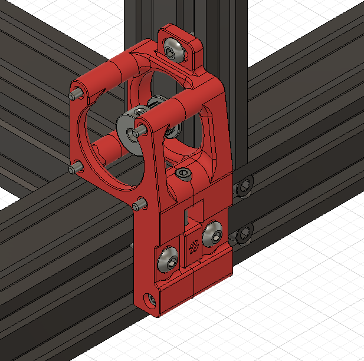

# SWE3-motor-mounts
More durable motor mounts for Ender3 -> Switchwire conversion based on yenda and TaffoFox's mods

There is an M5x10 BHCS to secure the mount to the Z frame to prevent misalignment, and an M3x30 screws and heatset to joining hte mounts below the adjuster.

This should fit completely with the stock enclosure cutouts.

Inspiration from [Yenda's more robust belt paths](https://github.com/VoronDesign/VoronUsers/tree/master/printer_mods/yenda/vsw_more_robust_belt_paths) mod.